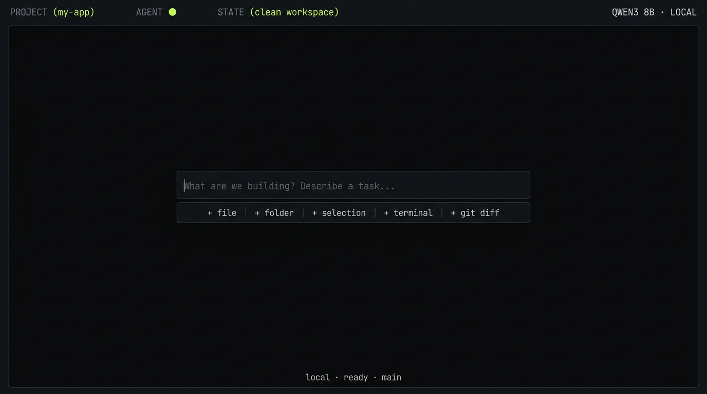
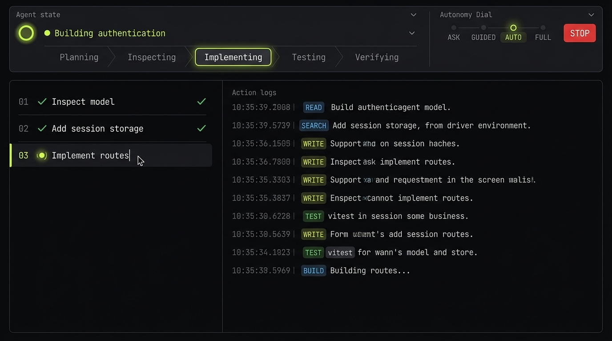
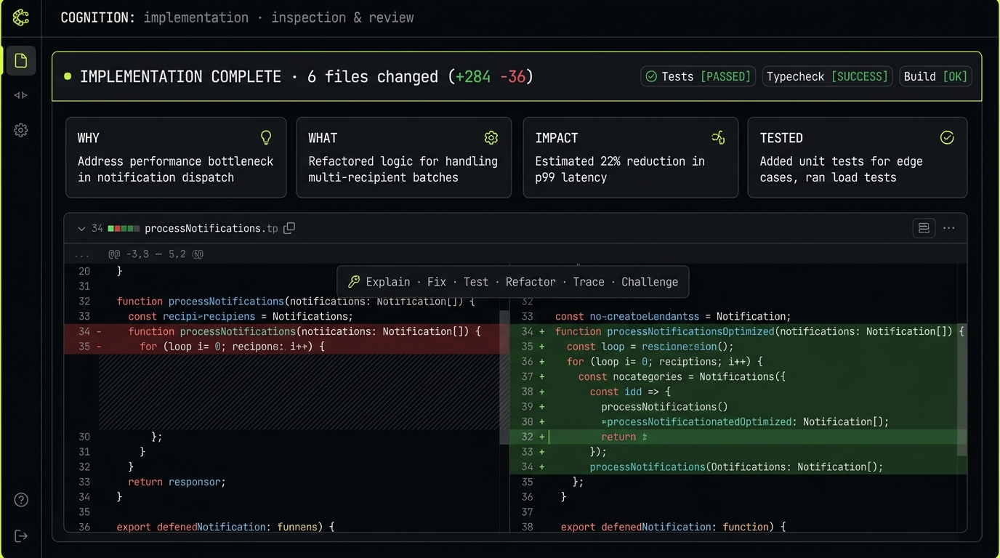

# Local Agentic Coder

> A radically minimalistic local-first agentic coding environment. A precision software engineering instrument designed for directing an autonomous coding agent — not another conventional IDE or chatbot.

---

## Previews

### 1. Radically Minimal Workspace (Idle Canvas)
The application opens into an uncluttered, distraction-free canvas with zero permanent sidebars, no dashboards, and no chat bubbles. Only the project identity, agent state, and central command console are visible.



---

### 2. Autonomous Execution & Action Timeline
When directing a task, the input collapses into a thin state bar. The agent formulates an editable execution plan alongside a chronological stream of concrete actions and terminal evidence (`READ`, `SEARCH`, `WRITE`, `EXECUTE`, `TEST`, `BUILD`).



---

### 3. Change Review & Code Inspection Mode
After execution, changes are organized into intention-based change groups (`AUTHENTICATION`, `TESTS`, `CONFIGURATION`). Each file provides actionable reasoning summaries (`WHY`, `WHAT`, `IMPACT`, `TESTED`) and inline agent capabilities (`Explain`, `Fix`, `Test`, `Refactor`, `Trace`, `Challenge`).



---

## The Core Interaction Loop

The fundamental UX architecture revolves around supervisor-directed autonomy:

```text
USER INTENT
     ↓
  CONTEXT
     ↓
   PLAN
     ↓
PERMISSION
     ↓
EXECUTION
     ↓
 EVIDENCE
     ↓
VERIFICATION
     ↓
  RESULT
```

---

## Key Features

### 1. Minimalistic Command Console
- Natural language software engineering objective input.
- Automatic intent classification: `creation`, `modification`, `debugging`, `investigation`, `refactoring`, `testing`, `documentation`, `architecture`, `review`.
- Subtle status line: `local · ready · main`.

### 2. Context Composer & Context Map
- Quick context attachments: `+ file`, `+ folder`, `+ selection`, `+ terminal`, `+ git diff`, `+ issue`.
- Automatic context detection based on target scope.
- **Context Map Tree**: visual hierarchy answering *"Why is the agent touching these files?"*.

### 3. Autonomy Dial
Four instant autonomy levels:
- **`ASK`**: The agent proposes every meaningful action before touching files.
- **`GUIDED`**: The agent inspects and edits code but prompts for network, terminal, or destructive operations.
- **`AUTO`**: Normal coding tasks run autonomously within workspace permissions.
- **`FULL`**: End-to-end execution within predefined workspace boundaries.

### 4. Permission Surface & Network Boundary
- Granular capability controls: `FILES`, `TERMINAL`, `NETWORK`, `GIT`, `DATABASE`, `BROWSER`.
- Visual boundary enforcement (`LOCAL ONLY` vs `NETWORK REQUEST`).
- Explicit escalation dialogs (`Allow Once`, `Allow Session`, `Deny`).

### 5. Chronological Action Timeline
- Communicates through actions and evidence rather than speech bubbles.
- Instant tool indicators: `READ`, `WRITE`, `SEARCH`, `EXECUTE`, `TEST`, `BUILD`, `LINTER`.
- Expandable raw terminal output, test runner output, and diff stats.

### 6. Verification & Failure Recovery
- First-class verification stage: Formatting (Prettier), Typecheck (TypeScript strict), Unit tests (Vitest), Integration tests, and Production Build.
- Structured failure recovery cards (`CAUSE`, `ACTION`, `[ Inspect ]`, `[ Fix Automatically ]`, `[ Stop ]`) instead of cryptic stack dumps.

### 7. Agent + Editor Hybrid (Inspection Mode)
- Editor appears only when inspecting code.
- Attached agent rationale at the bottom of the file.
- Floating inline agent actions on selection:
  - **Trace**: Generates caller and callee execution chain through the codebase.
  - **Explain**: Compact structural explanation.
  - **Challenge**: Scans for race conditions, security flaws, and missed edge cases.
  - **Fix / Test / Refactor**: Inline patch generation.

### 8. Task Snapshots & History
- Automatic state snapshot before every task begins.
- One-click `↺ Snapshot` rollback to immediately restore the workspace state.
- Chronological session timeline showing past task outcomes.

### 9. Explicit Project Memory & Rules
- **Project Memory**: Inspect and edit architectural facts, conventions, and preferences in `.agentrules` without hidden background telemetry.
- **Local Model Manager**: Real-time stats on local inference (`Qwen3 8B`, `Ollama`, Metal/CUDA GPU, token throughput, context window).

---

## Keyboard Shortcuts

| Shortcut | Action |
| :--- | :--- |
| `⌘K` / `Ctrl+K` | Open Intent Line / Global Command Palette |
| `Enter` | Submit objective / Confirm action |
| `Esc` | Close modal / Exit code inspection mode |
| `■ STOP` | Terminate running agent execution immediately |

---

## Technology Stack

- **Framework**: React 19 + TypeScript + Vite
- **Styling**: Tailwind CSS v4 with custom monochrome palette (`#08090A` canvas, `#B8FF3D` electric lime accent)
- **Typography**: Geist Mono & JetBrains Mono for razor-sharp code readability
- **Icons**: Lucide React
- **Local Engine**: Zero telemetry, local-first agent orchestrator

---

## Getting Started

```bash
# Clone the repository
git clone <repo-url>

# Install dependencies
npm install

# Start local development server
npm run dev

# Build for production
npm run build
```
